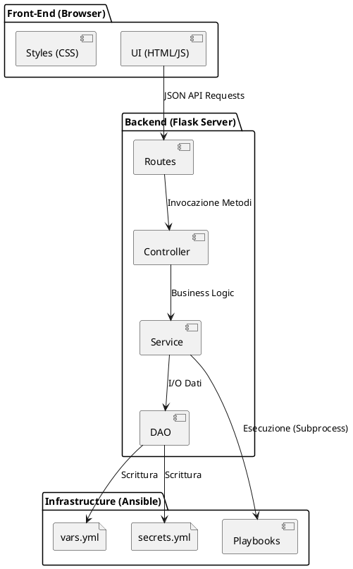
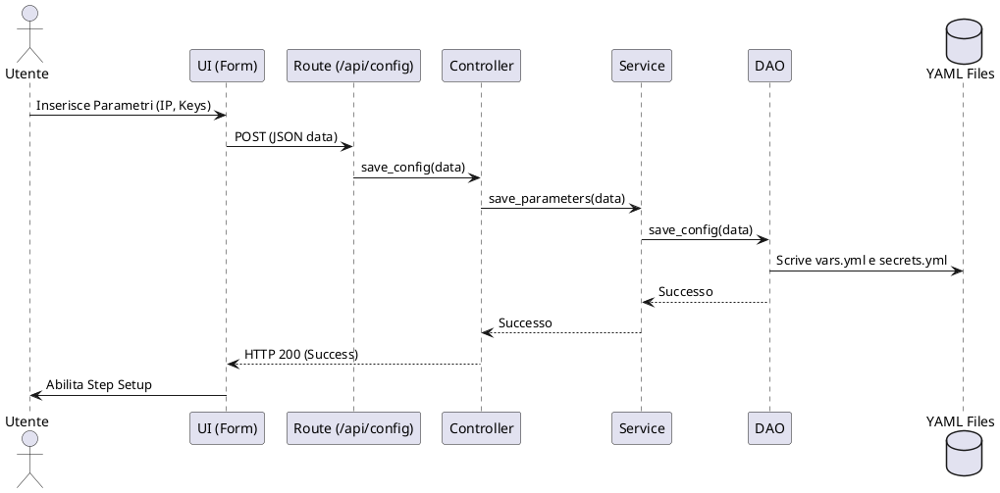
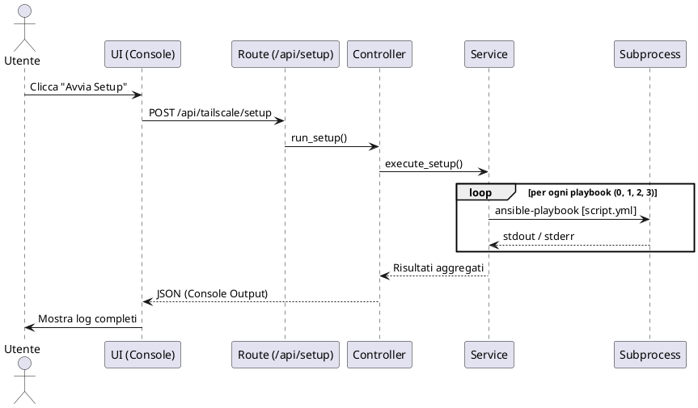

# 🏠 HomeLab Manager - Documentazione Tecnica

Questa documentazione descrive l'architettura e il funzionamento del sistema **HomeLab Manager**, una WebApp progettata per automatizzare il setup dell'infrastruttura domestica, con focus iniziale sulla configurazione di **Tailscale** come Gateway VPN su nodi **Proxmox**.

## 1. Visione d'Insieme
Il progetto trasforma script Ansible interattivi in un processo gestito via web. L'utente inserisce i parametri tramite un'interfaccia a step, il backend persiste le configurazioni in file YAML e orchestra l'esecuzione dei playbook tramite processi di sistema, monitorando l'output in tempo reale.

---

## 2. Struttura del Progetto
Il sistema segue una separazione netta delle responsabilità:

```text
HomeLab/
├── architecture/           # Logica Ansible (Playbook e Configurazioni)
│   └── tailscale/
│       ├── script/         # Playbook YAML (0..3)
│       ├── vars.yml        # Variabili LAN (generate da DAO)
│       └── secrets.yml     # Token e Segreti (generati da DAO)
├── webApp/
│   ├── Backend/            # Logica di Business (Flask)
│   │   ├── controllers/    # Gestione delle richieste HTTP
│   │   ├── daos/           # Accesso ai file di configurazione
│   │   ├── routes/         # Definizione endpoint API
│   │   ├── services/       # Esecuzione script e logica core
│   │   └── app.py          # Entry point e configurazione Flask
│   └── Front-End/          # Interfaccia Utente
│       ├── css/            # Fogli di stile (Dark Theme)
│       └── html/           # Template HTML (Dashboard a Step)
```

---

## 3. Diagrammi di Architettura

### Diagramma dei Componenti
Illustra la gerarchia dei moduli e le interazioni tra il Front-End e il sistema di automazione Ansible.



---

## 4. Diagrammi di Sequenza

### Flusso 1: Salvataggio Configurazione
L'utente inserisce i dati tecnici (IP, API Token). Il sistema valida e scrive i file necessari ad Ansible.



### Flusso 2: Esecuzione Setup Tailscale
Il backend lancia la sequenza di playbook Ansible in modalità non interattiva.



---

## 5. Dettagli di Implementazione

### Gestione Parametri
Gli script Ansible originali utilizzavano `ansible.builtin.pause`. Nella versione WebApp, queste variabili sono state spostate nel file `vars.yml` (IP Proxmox, storage, network) e `secrets.yml` (Token API Proxmox, Auth Key Tailscale). Il `TailscaleDAO` è responsabile della formattazione corretta di questi file per garantire che Ansible li legga come `vars_files`.

### Esecuzione Automazione
Il `TailscaleService` esegue i playbook in ordine:
1.  **0_setup_auth.yml**: Crea l'utente API su Proxmox.
2.  **1_create_lxc.yml**: Deploy dell'hardware LXC.
3.  **2_install_tailscale.yml**: Installazione e routing VPN.
4.  **3_setup_local_pc.yml**: (Opzionale) Configurazione client locale.

### Sicurezza e Ambiente
- **Virtual Environment**: L'applicazione deve girare in un `venv` per isolare le dipendenze (Flask).
- **Static/Template Paths**: Configurati in `app.py` utilizzando percorsi assoluti per permettere la separazione fisica tra cartella `Backend` e `Front-End`.

---
*Documentazione generata per HomeLab Manager - Giuseppe*# autoHomeLab
